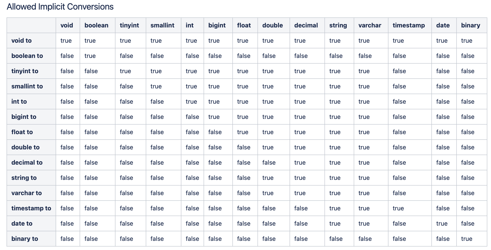

# 03

## DDL Data Definition Lanaguage

- create and read database
CREATE DATABASE [IF NOT EXISTS] database_name
[COMMENT database_comment]
[LOCATION hdfs_path]
[WITH DBPROPERTIES(property_name=property_value, ...)]

```sql
create database if not exists knowsky404
comment 'knowsky404 default database'
with dbproperties('create_date'='2024-03-24');

show databases like 'know*';
describe database knowsky404;
describe database extended knowsky404;
```

- modify database

用户可以alter database 修改数据库某些信息,包括 dbproperties、location、lowner user
修改数据库location, 只影响新建表路径,不会影响现有表路径

```sql
alter database database_name set dbproperties (property_name=property_value, ...);
alter database database_name set location hdfs_path;
alter database database_name set owner user user_name;

```

- drop database

DROP DATABASE [IF EXISTS]  database_name [RESTRICT|CASCADE]
RESTRICT: 严格模式, 若数据库不为空, 则会删除失败,默认为该模式
CASCADE: 级联模式,若数据库不为空,则会将库中的表一并删除

- create table

1. CTAS create table as select
   1. allow user create table used by select result
   2. table struct is same as with select result and do have all select result
   ```
   CREATE [TEMPORARY] TABLE [IF NOT EXISTS] table_name
   [COMMENT talbe_comment]
   [ROW FORMAT row_format]
   [STORED AS file_format]
   [LOCATION hdfs_path]
   [TBLPROPERTIES (proerty_name=proerty_value, ...)]
   [AS select_statament]
   ```
2. create table like
   1. allow user to copy a existed table struct without data

   ```
   CREATE [TEMPORARY] [EXTERNAL] TABLE [IF NOT EXISTS]
   [db_name.]table_name
   [LIKE exist_table_name]
   [ROW FORMAT row_format]
   [STORED AS file_format]
   [LOCATION hdfs_path]
   [TBLPROPERTIES (proerty_name=proerty_value, ...)]
   [AS select_statament]
   ```
3. basic create table
   ```
   CREATE [TEMPORARY] [EXTERNAL] TABLE [IF NOT EXISTS]
   [db_name.]table_name
   [(col_name DATA_TYPE [COMMENT col_comment], ...)]
   [COMMENT TABLE_COMMENT]
   [PARTITIONED BY (COL_NAME DATA_TYPE [COMMENT COL_COMMENT], ...)]
   [CLUSTERD BY (col_name, col_name, ...)
   [SORTED BY (col_name [ASC|DESC], ...)] INTO num_buckets BUCKETS]
   [ROW RORMAT row_format]
   [STORED AS file_format]
   [LOCATION hdfs_path]
   [TBLPROPERTIES (property_name=proerty_value, ...)]
   ```
   1. temporary 临时表, 仅在当前会话可见, 会话结束, 表会被删除
   2. external 外部表
      1. 与之对应的是内部表(管理表) 管理表意味着 Hive 会完全结果该表, 包括元数据和hdfs 中的数据
      2. 外部表纸接管元数据, 不接管 hdfs中的数据 | 用户删除外部表时,不会删除hdfs中的文件
   3. date_type
      1. 基本数据类型
         1. tinyint
         2. smallint
         3. int 4byte 有符号整数
         4. bigint 8byte 有符号整数
         5. boolean 布尔类型 true 或 false
         6. float 单精度浮点型
         7. double 双精度浮点型
         8. decimal 十进制精准数字类型 deciaml(16,2)
         9. varchar [1, 65535]
         10. string 无需指定最大长度
         11. timestamp 时间类型
         12. binary 二进制数据
      2. 复杂数据类型
         1. array
            1. 数组是一组相同类型的值的集合
            2. array<string>
            3. arr[0]
         2. map
            1. map 是一组相同类型的键值对集合
            2. map<string, int>
            3. map['key']
         3. struct
            1. 结构体有多个属性组成,每个属性都有自己的属性名和数据类型
            2. struct<id:int, name:string>
            3. struct.id
      3. Hive的基本数据类型可以做类型转换, 转换的方式包括隐式转换和显式转换
         1. [隐式转换](https://cwiki.apache.org/confluence/display/Hive/LanguageManual+Types#LanguageManualTypes-AllowedImplicitConversions)
          
         2. 显式转换
            1. cast(expr as <type>)
   4. row format
      1. [Hive SerDe](https://cwiki.apache.org/confluence/display/Hive/DeveloperGuide#DeveloperGuide-HiveSerDe)
      2. delimited 使用默认的serde
         1. fields terminated by : 列分隔符
         2. collection items terminated by : 复杂数据每个元素之间的分隔符
         3. map keys terminated by : map中key与value 对分隔符
         4. lines terminated by : 行分隔符
         5. null defined as : null 存储格式 默认值 \N
      3. serde 关键字
   5. stored as 执行文件格式 textfile sequence file orcfile parquet file
